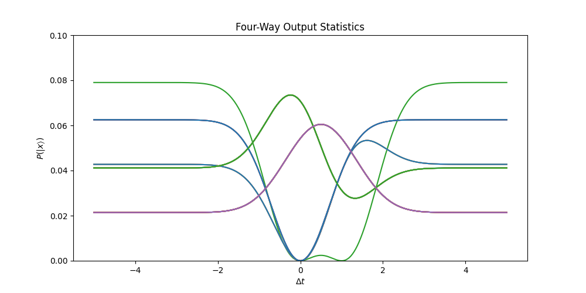
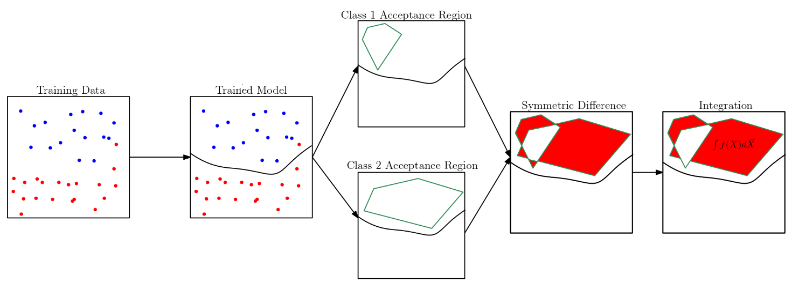
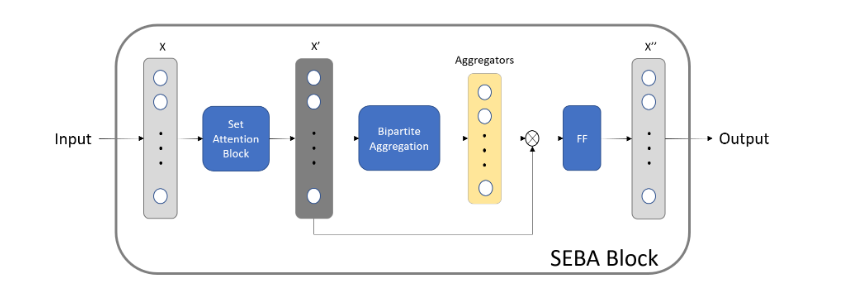

# Giorgian Borca-Tasciuc

## About Me
I did my undergraduate at Stony Brook University in Electrical Engineering and Computer Science. I spent an additional year at Stony Brook to finish my master's in Computer Science.

## Projects

### Fotini
[Fotini](https://github.com/giorgianb/fotini) is a general photon simulation
package, based on continuous-mode quantum mechanics. It is being actively
developed for the [Figueroa Research
Group](http://qit.physics.sunysb.edu/wordpress/). The purpose of fotini is to
enable the verification and debugging of optical circuits.

Fotini works through the efficient and correct handling of [Fock
States](https://en.wikipedia.org/wiki/Fock_state). It computes output
statistics using continuous-mode quantum mechanics, and thus for the supported
optical circuit elements, reproduces all important quantum mechanical effects.
While it supports *general* spectral amplitudes for a particular fock state, it
works particularly efficiently with spectral amplitudes expressible as
`C_1*exp(Σa_it_i^2 + Σb_i*t_i + c)`. These covers a important variety of
real-world usage.

Fotini can calculate the complex interference phenomena arising from
optical set-ups such as those seen in figure (1), producing the output
probability distribution seen in figure (2). Please see the the [main
page](https://github.com/giorgianb/fotini) for details on the using
fotini and for more examples.
<figure align="center">
  
  <figcaption>Fig. 1: Four-way Interference Set-Up</figcaption>
</figure>


<figure align="center">
  
  <figcaption>Fig. 2: Four Way Interference Statistics</figcaption>
</figure>

### Neural Network Fairness
Working with Professor Stanley Bak, Professor Steven Skiena, and Xingzhi Guo, I developed a [framework](https://github.com/giorgianb/nn_fairness) for quantifying *provable* fairness for neural networks. *H*-Polytopes that represent the entire input set are propagated through the network, and the location of each point in the input set is tracked. This leads to knowing the final classification of each point in the input set - where each point represents a hypothetical individual with a certain set of traits (age, education, race, gender, income, etc). This can be used to measure two key metrics developed for the framework in order to quantify fairness. A unique integration method for the *H*-Polytopes are used to make the problem tractable, although further work remains to be done to allow for computational tractability for higher dimensions (Polytope volume computation is a `#P`-hard problem).

This framework can be used to measure two key measures developed for the quantification of neural network fairness. I explain their motivation, derivation, and give examples in [this document](https://github.com/giorgianb/giorgianb.github.io/blob/main/docs/fairness-exploration.pdf). These metrics, named *advantage* and *preference*, roughly map to the legal notions of *disparate treatment* and *disparate impact*, respectively. However, they have the following important advantages:

- **Precision**: Each metric quantifies precisely the reason why unfair outcomes occur. The metrics also allow specifying *valid discrimination criteria* (i.e.: at least a high school education is required). This allows for the precise investigation and diagnostic of *proxy variables* used to illegitimately determine the person's protected class. 
- **Interpretabily**: The metrics are straightforwardly interpretable to allow for clear reasoning if they indicate an unacceptable amount of unfairness. For example, an *advantage* of 10% means that 10% of black individuals would have been interviewed if they had been white, all else being equal. A *preference* of 10% means that, applying the same rule for both male and female candidates, 10% more males than females are accepted. The classes depend on the problems at hand, and the metrics allow the handling of multiple classes.

A draft of the paper outlining this project can be found [here](https://github.com/giorgianb/giorgianb.github.io/blob/main/docs/Provable_Fairness_for_Neural_Network_Models_using_Formal_Verification.pdf).



### Multi-Stanza
My senior Computer Science Honors Thesis was developing [mStanza](https://arxiv.org/abs/2208.03094) which is available to run and use on [github](https://github.com/giorgianb/multi-stanza). It is an extension of Stanford's [Stanza](https://github.com/stanfordnlp/stanza) NLP package which allows or the parsing of natural language sentences. Multi-Stanza was designed to address a fundamental feature of natural languages which was not incorporated into the design of Stanza: *ambiguity*. Natural languages have several valid interpretations. This can occur (non-exhaustively) at the part-of-speech level of the sentence, at the lemma level of the sentence, or at the dependency level of the sentence. The following is an example of an ambiguous sentence at the dependency.
Consider the sentence:
````
I saw the man with the telescope.
````
For this sentence, it is not clear whether `the man` has the telescope or `I` have the telescope. Both intepretations are plausible. With Multi-Stanza, we can obtain both intepretations:
```python
>>> import stanza
>>> stanza.download('en')       # This downloads the English models for the neural pipeline
>>> nlp = stanza.Pipeline('en', depparse_n_preds=2) # This sets up a neural pipeline in English. It generates two results at the dependency parsing level.
>>> docs = nlp("I saw the man with the telescope.") # Returns a list of documents, each containing an interpretation of the sentence
>>> docs[0].sentences[0].print_dependencies() # Print the dependencies of the first interpretation. The man has the telescope
('I', 2, 'nsubj')
('saw', 0, 'root')
('the', 4, 'det')
('man', 2, 'obj')
('with', 7, 'case')
('the', 7, 'det')
('telescope', 4, 'nmod')
('.', 2, 'punct')
>>> docs[1].sentences[0].print_dependencies() # Print the dependencies of the second interpretation. I have the telescope!
('I', 2, 'nsubj')
('saw', 0, 'root')
('the', 4, 'det')
('man', 2, 'obj')
('with', 7, 'case')
('the', 7, 'det')
('telescope', 2, 'obl')
('.', 2, 'punct')
```

Multi-Stanza attempts to sort sentences by their plausibility of intepretation, from most plausible to least plausible, and offers rich mechanisms to tailor how that sorting is done towards the application at hand.


### Machine Learning for Physics Applications
Machine learning can be used in order to probe deeper into the fundamental laws of the universe. I am the lead research engineer at Sunrise Tech on the project of developing a triggering system for the new [sPHENIX](https://www.sphenix.bnl.gov/) particle detector. The triggering system is meant to detect events that occur extremely rarely and thus is expected to test the limits of the standard model. These are events  where a beauty particle is created and the `B+ 🠒 Anti D0 🠒 K+π` mode of decay is observed. 

The challenge is that the particle collider generates data at a rate that greatly exceeds the data throughput and capacity of existing memory storage systems, requiring a four order of magnitude reduction in the data throughput. The triggering system uses extremely limited data in order to make the decision whether to record the event. Traditional triggering systems, such as the minimum-bias systems which equally sample all events, or simple high-momentum triggers, are incapable of capturing these interesting events in large enough quantities for analysis. Using thoroughly-tested simulations to generate the data required, we are using machine learning models in order to accurately tag these extremely rare events from the pixels activated in the detector by the created particles. The triggering system must meet certain latency and throughput requirements, and must be deployable on an FPGA. 
 
A recent snapshot of the current state of our system was presented at the [ECML-PKDD](https://2022.ecmlpkdd.org/wp-content/uploads/2022/09/sub_1256.pdf). The incorporation of physics-based knowledge into the model and feature design has repeatedly allowed for improvements in model performance. I have recently made further improvements on the accuracy by applying supervised-contrastive learning method to focus the model's attention on pixels specifically activated by the `B+ 🠒 Anti D0 🠒 K+π` decay mode.



## Accepted Papers
T. Xuan, G. Borca-Tasciuc, Y. Zhu, Y. Sun, C. Dean, Z. Shi, and D. Yu, *Trigger Detection for the sPHENIX Experiment via Bipartite Graph Networks with Set Transformer*, European Conference on Machine Learning and Principles and Practice of Knowledge Discovery in Databases  (2022)

T. Xuan, Y. Zhu, G. Borca-Tasciuc, M. Xiong Liu, Y. Sun, C. Dean, Y. Corrales Morales, Z. Shi and D. Yu, *End-To-End Pipeline for Trigger Detection on Hit and Track Graphs*, Innovative Applications of Artificial Intelligence (2022)

Y. Whang, G. Borca-Tasciuc, N. Goel, P. Fodor, and M. Kifer, *Knowledge Authoring with Factual English*, International Conference on Logic Programming (2022)

Y. Zhu, T. Xuan, G. Borca-Tasciuc and Y. Sun, *A new sPHENIX Heavy quark trigger algorithm based on graph neutral networks, Machine Learning and the Physical Sciences Workshop at the 35th Conference on Neural Information Processing Systems* (2021)

## Working Papers
G. Borca-Tasciuc, X. Guo, S. Bak and S. Skiena, [*Provable Fairness for Neural Network Models using Formal Verification*](https://github.com/giorgianb/giorgianb.github.io/blob/main/doc/Provable_Fairness_for_Neural_Network_Models_using_Formal_Verification.pdf)

## Philosphical Interests
Correct Reasoning as at the core of effectively utilizing new knowledge. C. S. Pierce starts by investigating the basic elements present in our experience and uses this to develop his theory of signs, his theory of reality, and finally uses these previous two theories to investigate the types of reasoning and their justification. Nowadays, we take the existence of quantified logic for granted, and cannot image working without such a basic mental tool for reasoning. It is incredibly interesting to see Pierce develop and argue for quantified logic using his theories in an era when it was still emerging. It raises the question of whether we can further revolutionize the mental tools we use to reason to a similar extent. Pierce's writings on the process of improving the mental tools available at the time provide important insight into the process of doing so. By pushing the capabilities of logic, Pierce helped extend the types of statements for which one could provide rigourous proofs. Much of language use and argumentation remains outside the capabilities of the logic of today, so it is clear that there is still work to be done.

I am also interested in the implications of widespread smartphone usage, coupled with the existence of present social networks (Tiktok, Youtube, Instagram, Reddit, etc). Entertaining one's self was typically an active endeavor, and required work on one's part to keep ourselves entertained, whether it be through a hobby, reading, or social activities. Nowadays, it is possible to entertain one's self completely passively. Social media algorithms discover and even shape our interests. What effect does this removal of the active role in entertaining ourselves have on our ability to entertain and connect to others? What do relationships between people unused to entertaining themselves look like?
